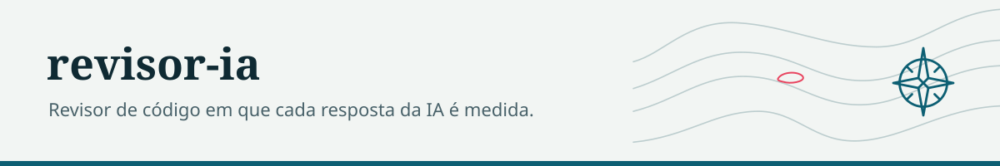
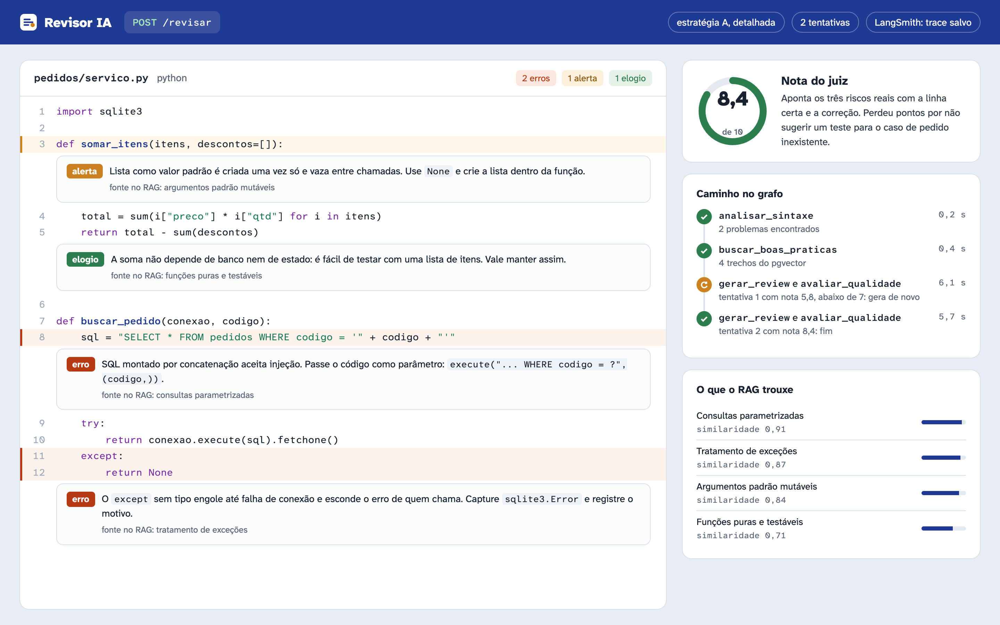
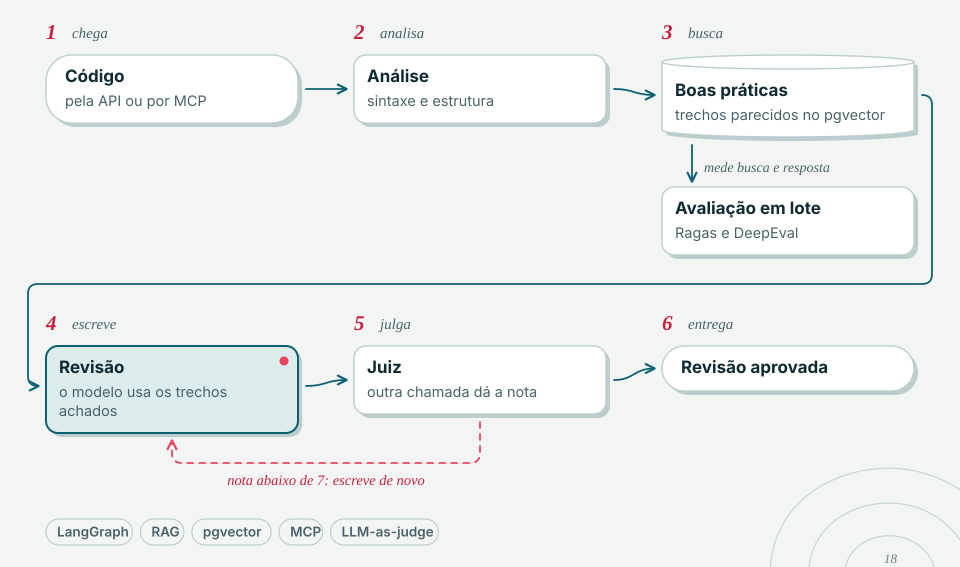

<picture>
  <source media="(prefers-color-scheme: dark)" srcset="docs/marca/cabecalho-escuro.svg">
  
</picture>

# Revisor IA — Projeto de Estudo

> Revisor de codigo com IA usando LangGraph, LangSmith, RAG com pgvector, MCP, e teste A/B.
> **100% educacional** — todo o codigo tem comentarios explicando o que faz e por que.



---

## Problema

Revisar código à mão não escala e é inconsistente. Um revisor automático com LLM só vale
a pena se der para **confiar** nele: medir se a sugestão é fiel ao código, se não
alucina, e comparar estratégias de prompt com dado — não com achismo.

## O que faz

Recebe um trecho de código e devolve uma revisão apoiada em RAG sobre uma base de boas
práticas (busca vetorial no pgvector). O fluxo é um grafo LangGraph com nós e arestas
condicionais; um segundo LLM atua como juiz da qualidade (LLM-as-judge), e as métricas
de RAG saem de Ragas e DeepEval. Feature flags ligam/desligam etapas sem redeploy, e o
agente é exposto tanto por API FastAPI quanto por um servidor MCP.

Cada módulo cobre, de propósito, um conceito de IA de produção — a tabela abaixo mapeia
onde cada um vive.

## Como rodar (resumo)

```bash
docker compose up -d           # PostgreSQL + pgvector e Ollama
cp .env.example .env           # preencher as variaveis
pip install -e .
uvicorn visoes.api:app --reload
pytest testes/ -v              # testes de esquemas, grafo e RAG
```

O setup completo está em [Setup Completo](#setup-completo).

## Status

Projeto de estudo, funcional módulo a módulo. Não é feito para produção — o objetivo é
ser lido e rodado para aprender os conceitos.

---

## O Que Este Projeto Ensina

Este projeto foi criado pra aprender na pratica os conceitos mais demandados
no mercado de IA/ML em 2025-2026. Cada modulo cobre um conceito diferente,
e todos se conectam num fluxo real de code review com IA.

### Conceitos Cobertos

| Conceito | Onde no Projeto | O Que Voce Aprende |
|----------|----------------|--------------------|
| **MVC** | `modelos/`, `visoes/`, `controladores/` | Separacao de responsabilidades em camadas |
| **LangGraph** | `agentes/grafo_revisao.py` | Grafos de estado, nos, arestas condicionais |
| **LangChain** | `agentes/ferramentas.py` | Integracao com LLMs, prompts, chains |
| **LangSmith** | `observabilidade/rastreamento.py` | Tracing, monitoramento, debug de LLM apps |
| **RAG Classico** | `rag/` | Chunking manual, embeddings, pgvector, similarity search |
| **pgvector** | `rag/vetorial.py`, `modelos/banco.py` | Busca vetorial no PostgreSQL, cosine distance |
| **Pydantic v2** | `modelos/esquemas.py`, `modelos/configuracao.py` | Validacao de dados, schemas tipados, settings |
| **MCP** | `mcp_servidor/`, `mcp_cliente/` | Criar e consumir MCP servers (protocolo da Anthropic) |
| **LLM-as-Judge** | `controladores/avaliador.py` | Avaliacao automatica de qualidade com LLM |
| **Teste A/B** | `controladores/teste_ab.py` | Comparacao de estrategias de prompt |
| **FastAPI** | `visoes/api.py` | API REST moderna com docs automaticos |
| **SQLAlchemy 2.0** | `modelos/banco.py`, `banco/conexao.py` | ORM async, models tipados, pgvector |
| **Ragas** | `avaliacao/ragas_eval.py` | Metricas padronizadas de RAG (faithfulness, relevancy) |
| **DeepEval** | `avaliacao/deepeval_eval.py` | Framework de testes pra LLM (hallucination, GEval) |
| **Feature Flags** | `modelos/feature_flags.py` | Liga/desliga funcionalidades sem deploy |
| **Controle de Estado** | `modelos/esquemas.py` (TypedDict) | Estado imutavel fluindo pelo grafo |
| **Docker Compose** | `docker-compose.yml` | Infra local com containers |

---

## Arquitetura

<picture>
  <source media="(prefers-color-scheme: dark)" srcset="docs/marca/diagrama-escuro.svg">
  
</picture>


```
revisor-ia/
│
├── modelos/                 ← MODEL (M do MVC)
│   ├── esquemas.py          │  Pydantic schemas (validacao de entrada/saida)
│   ├── banco.py             │  SQLAlchemy models (tabelas do banco)
│   ├── configuracao.py      │  Pydantic Settings (carrega .env)
│   └── feature_flags.py     │  Feature flags (liga/desliga funcionalidades)
│
├── visoes/                  ← VIEW (V do MVC)
│   └── api.py               │  FastAPI endpoints (interface pro usuario)
│
├── controladores/           ← CONTROLLER (C do MVC)
│   ├── revisor.py           │  Orquestra o fluxo de review
│   ├── rag.py               │  Ponte entre API e RAG
│   ├── avaliador.py         │  LLM-as-Judge (qualidade)
│   └── teste_ab.py          │  Teste A/B entre estrategias
│
├── agentes/                 ← LANGGRAPH (cerebro da IA)
│   ├── grafo_revisao.py     │  Grafo de estados: nos + arestas + decisoes
│   ├── ferramentas.py       │  Tools do agente (chamadas ao LLM)
│   └── prompts.py           │  Templates de prompt (estrategia A e B)
│
├── rag/                     ← RAG CLASSICO (conhecimento)
│   ├── chunking.py          │  Divide texto em pedacos (com overlap)
│   ├── embeddings.py        │  Converte texto em vetores (Ollama)
│   ├── vetorial.py          │  CRUD no pgvector (insert + similarity search)
│   └── ingestao.py          │  Pipeline completo: texto → chunks → vetores → banco
│
├── avaliacao/               ← AVALIAÇÃO DE QUALIDADE
│   ├── ragas_eval.py        │  Ragas: metricas de RAG (faithfulness, relevancy)
│   └── deepeval_eval.py     │  DeepEval: testes de LLM (hallucination, GEval)
│
├── observabilidade/         ← LANGSMITH (monitoramento)
│   └── rastreamento.py      │  Tracing, callbacks, metricas de LLM
│
├── mcp_servidor/            ← MCP SERVER (expoe tools pra IAs)
│   └── servidor.py          │  Tools: revisar_codigo, buscar_boas_praticas
│
├── mcp_cliente/             ← MCP CLIENT (consome tools)
│   └── cliente.py           │  Demonstra como conectar num MCP server
│
├── banco/                   ← BANCO DE DADOS
│   └── conexao.py           │  Engine, session factory, init_db
│
├── seeds/                   ← DADOS INICIAIS
│   └── boas_praticas.json   │  20 boas praticas pra popular o RAG
│
└── testes/                  ← TESTES
    ├── test_esquemas.py     │  Valida schemas Pydantic
    ├── test_rag.py          │  Testa chunking (unitario)
    └── test_grafo.py        │  Testa logica do grafo
```

### Como as Camadas se Conectam

```
Usuario (curl/browser)
    │
    ▼
[FastAPI - visoes/api.py]         ← View: recebe request, retorna response
    │
    ▼
[Controller - controladores/]      ← Controller: orquestra a logica
    │
    ├──▶ [LangGraph - agentes/]   ← Agente: grafo de estados multi-step
    │       │
    │       ├──▶ [LLM - Ollama]   ← Modelo de linguagem local
    │       │
    │       └──▶ [RAG - rag/]     ← Busca vetorial no pgvector
    │               │
    │               └──▶ [PostgreSQL + pgvector]
    │
    └──▶ [LangSmith]              ← Observabilidade: tracing de cada chamada
```

---

## Fluxo do Agente (LangGraph)

O LangGraph orquestra o review em 4 passos, com uma decisao condicional:

```
[INICIO]
    │
    ▼
[1. analisar_sintaxe]              ← LLM detecta problemas no codigo
    │
    ▼
[2. buscar_boas_praticas]          ← RAG busca no pgvector (similarity search)
    │
    ▼
[3. gerar_review]                  ← LLM gera review (estrategia A ou B)
    │
    ▼
[4. avaliar_qualidade]             ← LLM-as-Judge da nota 0-10
    │
    ├── nota >= 7 ──────▶ [FIM]   ← Review aprovado!
    │
    └── nota < 7 ───────▶ [3. gerar_review]  ← Re-gera (max 3x)
```

**Estado que flui pelo grafo:**
```python
class EstadoRevisao(TypedDict):
    codigo: str               # codigo a revisar
    linguagem: str            # python, javascript...
    problemas_sintaxe: list   # preenchido pelo no 1
    boas_praticas: list       # preenchido pelo no 2 (RAG)
    review: str               # preenchido pelo no 3
    nota_qualidade: float     # preenchido pelo no 4 (0-10)
    estrategia: str           # "A" (detalhado) ou "B" (conciso)
    tentativas: int           # quantas vezes re-gerou
```

---

## RAG — Como Funciona (Passo a Passo)

RAG (Retrieval-Augmented Generation) e a tecnica de "dar memoria" ao LLM:

```
1. INGESTAO (uma vez)
   Documento ──▶ Chunking ──▶ Embeddings ──▶ pgvector
   "Use nomes     "Use nomes    [0.12,        INSERT INTO
    descritivos     descritivos   -0.34,       boas_praticas
    para vars..."   para..."      0.56, ...]   (texto, embedding)

2. BUSCA (cada request)
   Query ──▶ Embedding ──▶ pgvector ──▶ Top K resultados
   "nomes"   [0.11,        ORDER BY     "Use nomes descritivos..."
              -0.33,        embedding
              0.55, ...]    <-> query
                            LIMIT 5

3. GERACAO
   Query + Contexto RAG ──▶ LLM ──▶ Resposta fundamentada
   "Revise este codigo"     Ollama   "O codigo usa nomes
    + "Use nomes                      pouco descritivos..."
    descritivos..."
```

### Chunking (rag/chunking.py)
```
Texto: "ABCDEFGHIJKLMNOPQRSTUVWXYZ"
Tamanho: 10, Overlap: 3

Chunk 1: "ABCDEFGHIJ"
Chunk 2: "HIJKLMNOPQ"   ← "HIJ" repete (overlap)
Chunk 3: "OPQRSTUVWX"   ← "OPQ" repete
Chunk 4: "VWXYZ"

Por que overlap? Evita perder contexto nas bordas dos chunks.
```

### pgvector (rag/vetorial.py)
```sql
-- Busca os 5 textos mais similares a uma query
SELECT texto
FROM boas_praticas
ORDER BY embedding <-> :query_embedding  -- cosine distance
LIMIT 5;

-- <-> e o operador do pgvector pra distancia de cosseno
-- 0 = identicos, 1 = sem relacao, 2 = opostos
```

---

## LangSmith — Observabilidade

LangSmith e a plataforma de monitoramento da LangChain.
Permite rastrear cada chamada ao LLM, ver inputs/outputs,
medir latencia e debugar problemas.

```
Sem LangSmith:         Com LangSmith:
"O review saiu ruim"   "No no 3, o prompt recebeu
 → ¯\_(ツ)_/¯          0 boas praticas do RAG
                        porque a query de embedding
                        retornou resultados irrelevantes.
                        Latencia: 2.3s no embedding."
```

### Como funciona no projeto

```python
# 1. Configura tracing (observabilidade/rastreamento.py)
os.environ["LANGSMITH_TRACING"] = "true"

# 2. Cada chamada ao LLM e automaticamente rastreada
# 3. Voce ve tudo no dashboard: smith.langchain.com
```

---

## Ragas — Avaliacao de RAG

Ragas (RAG Assessment) avalia a QUALIDADE do pipeline RAG com metricas padronizadas.

```
Sem Ragas (na mao):
  prompt = "A resposta eh fiel ao contexto? Nota 0-1"
  → 1 chamada LLM, avaliacao superficial

Com Ragas:
  evaluate(dataset, metrics=[faithfulness, answer_relevancy, ...])
  → Extrai claims da resposta, classifica cada um, calcula score
  → 10+ chamadas LLM, avaliacao rigorosa e padronizada
```

### Metricas

| Metrica | O que mede | Como faria na mao |
|---------|------------|-------------------|
| **faithfulness** | Resposta eh fiel ao contexto? | Prompt: "cada afirmacao esta no contexto?" |
| **answer_relevancy** | Resposta eh relevante? | Comparar embeddings pergunta vs resposta |
| **context_precision** | Chunks retornados sao uteis? | Classificar cada chunk como util/inutil |
| **context_recall** | RAG trouxe tudo necessario? | Comparar ground truth com chunks |

### Versao manual vs Framework

O projeto tem AMBAS as implementacoes (pra estudo):
- `avaliar_com_ragas()` — usa o framework Ragas
- `avaliar_rag_manual()` — faz a mesma coisa com 1 prompt LLM

---

## DeepEval — Testes de LLM

DeepEval eh "pytest pra IA" — roda metricas de qualidade e da pass/fail.

```
Sem DeepEval (na mao):
  nota = await perguntar_llm("eh relevante? 0-1", resposta)
  assert float(nota) > 0.7  # threshold manual

Com DeepEval:
  metric = AnswerRelevancyMetric(threshold=0.7)
  metric.measure(test_case)  # extrai claims, classifica, calcula
  assert metric.is_successful()  # integra com pytest!
```

### Metricas

| Metrica | O que mede | Como faria na mao |
|---------|------------|-------------------|
| **AnswerRelevancy** | Resposta responde a pergunta? | Prompt pedindo nota 0-1 |
| **Faithfulness** | Baseada no contexto? | Prompt verificando cada claim |
| **Hallucination** | LLM inventou info? | NLI: detectar contradicoes |
| **GEval** | Criterios customizados | Escrever rubric manual + prompt |

---

## Feature Flags

Feature flags permitem ligar/desligar funcionalidades sem alterar codigo.

```bash
# Ver todas as flags
curl http://localhost:8000/flags

# Desligar Ragas (fica mais rapido)
curl -X PUT "http://localhost:8000/flags/FF_RAGAS_ATIVO?valor=false"

# Desligar loop de re-geracao
curl -X PUT "http://localhost:8000/flags/FF_LOOP_REGENERACAO?valor=false"
```

### Flags disponiveis

| Flag | Padrao | O que controla |
|------|--------|---------------|
| `FF_LANGSMITH_ATIVO` | false | Tracing LangSmith |
| `FF_RAGAS_ATIVO` | true | Avaliacao Ragas |
| `FF_DEEPEVAL_ATIVO` | true | Avaliacao DeepEval |
| `FF_LOOP_REGENERACAO` | true | Re-gera review se nota < 7 |
| `FF_MAX_TENTATIVAS` | 3 | Max tentativas de re-geracao |
| `FF_RAG_ATIVO` | true | Busca de boas praticas |
| `FF_RAG_TOP_K` | 5 | Quantidade de resultados RAG |
| `FF_TESTE_AB_ATIVO` | true | Teste A/B de estrategias |

---

## MCP — Model Context Protocol

MCP e um protocolo aberto da Anthropic pra expor ferramentas pra IAs.

```
Sem MCP:                        Com MCP:
Cada IA reimplementa tudo       IA chama tools padronizadas

Claude: "preciso buscar          Claude: tool_call(
 boas praticas... como?"           "buscar_boas_praticas",
                                    {"query": "nomes"}
                                 )
```

### Server (mcp_servidor/servidor.py)
Expoe 2 tools:
- `revisar_codigo(codigo, linguagem)` → review completo
- `buscar_boas_praticas(query)` → busca no RAG

### Client (mcp_cliente/cliente.py)
Conecta no server e chama as tools programaticamente.

---

## Stack Completa

| Tech | Versao | Uso | Por Que no Curriculo |
|------|--------|-----|---------------------|
| **Python** | 3.11+ | Linguagem base | Mais demandada pra IA |
| **FastAPI** | 0.115+ | API REST | Padrao de mercado Python |
| **LangChain** | 0.3+ | LLM framework | Framework #1 de LLM apps |
| **LangGraph** | 0.2+ | Agentes stateful | Em alta, diferencial forte |
| **LangSmith** | - | Observabilidade | Debug/monitoring de LLM apps |
| **Ollama** | - | LLM local | Zero custo, privacy-first |
| **PostgreSQL** | 16 | Banco relacional | Enterprise standard |
| **pgvector** | 0.3+ | Busca vetorial | RAG sem abstracoes |
| **Pydantic** | v2 | Validacao | Usado em tudo moderno |
| **SQLAlchemy** | 2.0+ | ORM async | Padrao enterprise |
| **Ragas** | 0.2+ | Avaliacao de RAG | Padrao de mercado pra eval de RAG |
| **DeepEval** | 1.0+ | Testes de LLM | "Pytest pra IA", trending |
| **MCP** | 1.0+ | Protocolo IA | Trending (Anthropic) |
| **Docker** | - | Containers | Infra basica |
| **Pytest** | 8.0+ | Testes | Essencial |

---

## Setup Completo

### 1. Pre-requisitos

```bash
# Python 3.11+
python3 --version

# Docker (pra PostgreSQL)
docker --version

# Ollama (LLM local)
# Mac:
brew install ollama
# Linux:
curl -fsSL https://ollama.ai/install.sh | sh
```

### 2. Modelos Ollama

```bash
# LLM pra gerar texto (chat, review, avaliacao)
ollama pull llama3.1

# Modelo de embeddings (converte texto em vetores)
ollama pull nomic-embed-text

# Inicia o Ollama (roda na porta 11434)
ollama serve
```

### 3. Banco de Dados

```bash
# Sobe PostgreSQL com pgvector
docker compose up -d

# Verifica se esta rodando
docker compose ps
```

### 4. Projeto Python

```bash
# Clona e entra na pasta
cd revisor-ia

# Cria ambiente virtual
python3 -m venv .venv
source .venv/bin/activate  # Linux/Mac
# .venv\Scripts\activate   # Windows

# Instala dependencias
pip install -e ".[dev]"

# Configura ambiente
cp .env.example .env
# Edite o .env se necessario (padroes funcionam pra dev local)
```

### 5. LangSmith (Opcional mas Recomendado)

```bash
# 1. Crie conta em: https://smith.langchain.com
# 2. Gere uma API key
# 3. Adicione no .env:
#    LANGSMITH_API_KEY=lsv2_pt_xxxxxxxxxxxx
#    LANGSMITH_PROJECT=revisor-ia
```

### 6. Rodar

```bash
# Inicia a API (cria tabelas e popula base automaticamente)
uvicorn visoes.api:app --reload

# Abre docs interativos (Swagger UI)
open http://localhost:8000/docs
```

---

## Endpoints da API

| Metodo | Rota | Descricao | Exemplo |
|--------|------|-----------|---------|
| `GET` | `/saude` | Health check | `curl localhost:8000/saude` |
| `POST` | `/revisar` | Review de codigo | Ver abaixo |
| `POST` | `/rag/ingerir` | Adicionar doc ao RAG | Ver abaixo |
| `GET` | `/rag/buscar` | Buscar boas praticas | `curl "localhost:8000/rag/buscar?q=nomes"` |
| `POST` | `/teste-ab` | Teste A/B | Ver abaixo |
| `POST` | `/avaliar` | Review + Ragas + DeepEval | Ver abaixo |
| `GET` | `/flags` | Listar feature flags | `curl localhost:8000/flags` |
| `PUT` | `/flags/{nome}` | Alterar flag em runtime | Ver abaixo |

### Exemplos de Uso

```bash
# 1. Revisar codigo
curl -X POST http://localhost:8000/revisar \
  -H "Content-Type: application/json" \
  -d '{
    "codigo": "def f(x): return x+1",
    "linguagem": "python"
  }'

# 2. Revisar com estrategia especifica
curl -X POST http://localhost:8000/revisar \
  -H "Content-Type: application/json" \
  -d '{
    "codigo": "def calc(x,y,z): a=x+y; return a*z",
    "linguagem": "python",
    "estrategia": "A"
  }'

# 3. Buscar boas praticas no RAG
curl "http://localhost:8000/rag/buscar?q=como+nomear+variaveis&top_k=3"

# 4. Adicionar documento ao RAG
curl -X POST http://localhost:8000/rag/ingerir \
  -H "Content-Type: application/json" \
  -d '{
    "texto": "Sempre use async/await pra operacoes I/O em Python.",
    "fonte": "python_async"
  }'

# 5. Teste A/B (compara estrategias de prompt)
curl -X POST "http://localhost:8000/teste-ab?rodadas=2" \
  -H "Content-Type: application/json" \
  -d '{
    "codigo": "def process(d): return [i for i in d if i > 0]",
    "linguagem": "python"
  }'

# 6. Avaliacao completa (Review + Ragas + DeepEval + manual)
curl -X POST http://localhost:8000/avaliar \
  -H "Content-Type: application/json" \
  -d '{
    "codigo": "def f(x): return x+1",
    "linguagem": "python"
  }'

# 7. Ver feature flags
curl http://localhost:8000/flags

# 8. Desligar Ragas (fica mais rapido)
curl -X PUT "http://localhost:8000/flags/FF_RAGAS_ATIVO?valor=false"

# 9. Desligar loop de re-geracao
curl -X PUT "http://localhost:8000/flags/FF_LOOP_REGENERACAO?valor=false"
```

---

## MCP (Model Context Protocol)

```bash
# Rodar o servidor MCP
python -m mcp_servidor.servidor

# Em outro terminal, testar com o cliente
python -m mcp_cliente.cliente
```

### Configurar no Claude Code

Adicione no seu `claude_desktop_config.json`:
```json
{
  "mcpServers": {
    "revisor-ia": {
      "command": "python",
      "args": ["-m", "mcp_servidor.servidor"],
      "cwd": "/caminho/para/revisor-ia"
    }
  }
}
```

---

## Testes

```bash
# Roda todos os testes
pytest testes/ -v

# Roda apenas testes de schema
pytest testes/test_esquemas.py -v

# Roda apenas testes de RAG
pytest testes/test_rag.py -v

# Roda com output detalhado
pytest testes/ -v --tb=short
```

---

## Guia de Estudo — Por Onde Comecar

Se voce quer entender o projeto do zero, siga esta ordem:

### Semana 1: Fundamentos
1. `modelos/configuracao.py` — como Pydantic Settings carrega .env
2. `modelos/esquemas.py` — schemas de validacao (entrada/saida)
3. `banco/conexao.py` — como conectar no PostgreSQL async
4. `modelos/banco.py` — como definir tabelas com SQLAlchemy + pgvector

### Semana 2: RAG
5. `rag/chunking.py` — como dividir texto em pedacos
6. `rag/embeddings.py` — como transformar texto em vetores
7. `rag/vetorial.py` — como buscar por similaridade no pgvector
8. `rag/ingestao.py` — pipeline completo de ingestao

### Semana 3: Agentes
9. `agentes/prompts.py` — como escrever prompts eficientes
10. `agentes/ferramentas.py` — como criar tools pro agente
11. `agentes/grafo_revisao.py` — como montar o grafo LangGraph
12. `observabilidade/rastreamento.py` — como monitorar com LangSmith

### Semana 4: Avaliacao de Qualidade
13. `avaliacao/ragas_eval.py` — metricas de RAG (framework vs manual)
14. `avaliacao/deepeval_eval.py` — testes de LLM (framework vs manual)
15. `controladores/avaliador.py` — como implementar LLM-as-Judge
16. `modelos/feature_flags.py` — como usar feature flags

### Semana 5: Integracao
17. `controladores/revisor.py` — como conectar tudo no controller
18. `controladores/teste_ab.py` — como rodar teste A/B
19. `visoes/api.py` — como expor via FastAPI

### Semana 6: MCP + Testes
20. `mcp_servidor/servidor.py` — como criar um MCP server
21. `mcp_cliente/cliente.py` — como consumir um MCP server
22. `observabilidade/rastreamento.py` — como monitorar com LangSmith
23. `testes/` — como testar cada camada

---

## Glossario

| Termo | Significado |
|-------|-------------|
| **RAG** | Retrieval-Augmented Generation — dar memoria ao LLM buscando dados relevantes |
| **Embedding** | Vetor numerico que representa o "significado" de um texto |
| **pgvector** | Extensao do PostgreSQL pra armazenar e buscar vetores |
| **Chunking** | Dividir texto grande em pedacos menores pra embeddings |
| **Overlap** | Sobreposicao entre chunks (evita perder contexto nas bordas) |
| **Cosine Distance** | Medida de similaridade entre vetores (0=igual, 2=oposto) |
| **LLM-as-Judge** | Usar um LLM pra avaliar a saida de outro LLM |
| **Ragas** | Framework de avaliacao de RAG (faithfulness, relevancy, precision, recall) |
| **DeepEval** | Framework de testes pra LLM apps (hallucination, GEval, toxicity) |
| **Faithfulness** | Metrica: a resposta eh fiel ao contexto fornecido? (nao inventou?) |
| **Hallucination** | Quando o LLM inventa informacao que nao esta no contexto |
| **GEval** | Avaliacao customizada: voce define criterios, o LLM avalia |
| **Feature Flag** | Chave liga/desliga pra funcionalidades (sem alterar codigo) |
| **NLI** | Natural Language Inference — classificar relacao entre frases (suporta/contradiz) |
| **MCP** | Model Context Protocol — protocolo pra IAs chamarem tools |
| **LangGraph** | Framework pra criar agentes como grafos de estados |
| **LangSmith** | Plataforma de observabilidade/tracing pra LLM apps |
| **StateGraph** | Grafo onde cada no le/escreve num estado compartilhado |
| **Tool** | Funcao que um agente pode chamar durante execucao |
| **Lifespan** | Codigo que roda no startup/shutdown da API FastAPI |
| **TypedDict** | Dicionario tipado — usado pelo LangGraph pro estado |
